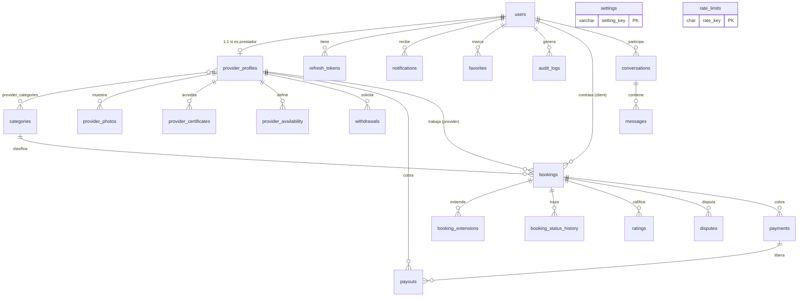

# Base de datos (MySQL 8)

Migraciones en `database/migrations/` (ejecutar en orden). Seeds en
`database/seeds/`. Convenciones: InnoDB, utf8mb4, FKs explícitas, índices en
columnas de búsqueda, **soft delete** (`deleted_at`) en users, categories y
provider_profiles, dinero en `DECIMAL(12,2)`, trigger para mantener el
promedio de calificaciones.

## Diagrama entidad-relación

## Tablas principales

| Tabla | Propósito |
|---|---|
| `users` | Los 3 roles. Lockout (`failed_attempts`, `locked_until`), verificación de email, geolocalización, soft delete |
| `provider_profiles` | Bio, tarifas hora/día, radio, disponibilidad, **saldo**, rating cacheado, verificación |
| `bookings` | Contratación: unidad (hora/día/semana/mes), cantidad, tarifa congelada, estado, estado de pago, ubicación |
| `booking_extensions` | Cada extensión: cantidad extra, monto, nueva fecha de fin |
| `payments` | Pago del cliente → plataforma. Congela `commission_percent` vigente y desglosa comisión/impuesto/neto |
| `payouts` | Liberación del neto al prestador, aprobada por admin |
| `withdrawals` | Retiros: el saldo se **reserva** al solicitar; si se rechaza, se devuelve |
| `ratings` | Bidireccional, única por (booking, rater). Trigger actualiza el promedio |
| `audit_logs` | Auditoría con usuario, acción, entidad, IP y detalles JSON |
| `rate_limits` | Ventana fija para el throttle de la API |

## Integridad

- Tarifa y comisión se **congelan** en el momento de la operación (los
  cambios de configuración no alteran registros históricos).
- Operaciones de dinero envueltas en **transacciones** (pago+payout,
  aprobación, retiro).
- `payments`/`payouts` nunca se borran (sin ON DELETE CASCADE hacia dinero).
